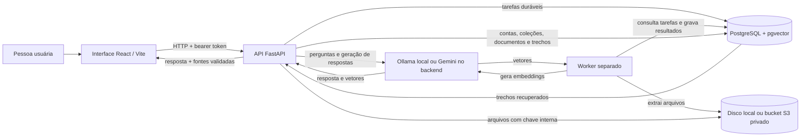

# AcervoIA

AcervoIA organiza documentos técnicos e responde perguntas com evidências rastreáveis. O objetivo é reduzir o tempo gasto procurando instruções em manuais e evitar respostas que misturem equipamentos ou versões: a resposta se apoia nos documentos da coleção e mostra quais trechos foram usados; sem evidência suficiente, deve se abster. Há uma trilha opcional de demonstração pública, mas ela ainda não foi publicada nem implantada.

O projeto está em desenvolvimento e foi validado localmente. Não há evidência de publicação, operação em produção ou avaliação representativa de uso real.

## Como funciona

1. A pessoa entra com uma conta criada localmente e organiza seu acervo em coleções privadas.
2. Envia um PDF, DOCX ou TXT (até 20 MiB) para uma coleção. Um hash SHA-256 permite reutilizar o mesmo documento dentro da mesma coleção sem duplicá-lo.
3. A API extrai o texto e o divide em trechos sobrepostos. Para PDFs, registra a página quando disponível.
4. O worker gera embeddings pelo provedor configurado para a conta e os guarda no PostgreSQL com pgvector.
5. A pessoa escolhe o modo de busca, pode limitar a consulta a um ou mais documentos e faz uma pergunta. Sem seleção, a coleção inteira continua no escopo. A API recupera trechos, pede uma resposta fundamentada ao provedor de chat configurado e retorna fontes construídas e validadas pelo backend. Respostas aceitas e abstenções ficam no histórico privado da coleção com o escopo documental, permitindo consultar novamente com os mesmos filtros.

Os dados de cada conta são isolados pelo usuário associado ao token; o cliente não escolhe o proprietário. O conteúdo dos documentos é tratado como dado não confiável, nunca como instrução para o modelo. Nas fontes da resposta e do histórico, é possível abrir o PDF na página citada ou baixar o DOCX/TXT original; a API confere novamente a propriedade antes de entregar o arquivo.

## Arquitetura



### Componentes e decisões

- **Frontend:** React, TypeScript e Vite em `web/`. O cliente centraliza chamadas HTTP e guarda o token em `sessionStorage`; a API é a autoridade final para autenticação e autorização.
- **API:** FastAPI, Pydantic e SQLAlchemy. Alembic controla a evolução do schema. Senhas são armazenadas como hashes Argon2; tokens JWT são assinados com uma chave configurada no ambiente.
- **Banco e arquivos:** PostgreSQL com a extensão pgvector armazena metadados, trechos e vetores de 768 dimensões. No desenvolvimento, os arquivos ficam em `data/uploads/`; a configuração de produção exige bucket S3-compatível privado, com nomes internos aleatórios — não se usa o nome enviado como caminho.
- **Processamento:** a API cria tarefas duráveis separadas para extração/chunking e embeddings; um worker Compose as consulta. PDF, DOCX e TXT são extraídos sem OCR e divididos em trechos de 1.000 caracteres, com sobreposição de 150. Reprocessar substitui os trechos anteriores; falhas de extração são registradas sem remover o arquivo.
- **Provedores de IA:** Ollama é o padrão para chat e embeddings, inclusive na demo local. A pessoa responsável pode configurar cada uso separadamente para Ollama ou Gemini; visitantes não escolhem o provedor. Gemini é chamado somente no backend/worker, a chave não vai ao navegador, e cada vetor guarda provedor e modelo para impedir busca cruzada entre espaços incompatíveis.
- **Busca:** vetorial usa distância cosseno; textual combina full-text search do PostgreSQL com correspondência literal normalizada para códigos, siglas e modelos; híbrida combina rankings com Reciprocal Rank Fusion (RRF).
- **Resposta com fontes (RAG):** o serviço recupera trechos, instrui o modelo a escolher somente IDs de fonte permitidos e mantém o texto documental como entrada não confiável. O backend valida cada referência contra os resultados reais; permite uma única tentativa controlada de correção e, se não validar, retorna uma resposta segura sem exibir fontes inválidas.

## Rodar localmente

### Pré-requisitos

- Python dentro da faixa declarada em `pyproject.toml` (`>=3.12,<3.15`); Python 3.12 é usado pela CI.
- Node.js 22 para reproduzir a CI do frontend.
- Docker Compose para PostgreSQL com pgvector.
- Ollama local com os modelos descritos abaixo para uso local; Gemini é opcional.

### Configuração

Use [`.env.example`](.env.example) como lista de nomes e crie um `.env` privado com os valores adequados. O Compose local usa `POSTGRES_DB`, `POSTGRES_USER` e `POSTGRES_PASSWORD`; API e Alembic usam `DATABASE_URL`; autenticação usa `AUTH_SECRET_KEY` (mínimo 32 bytes). Nunca versionar ou compartilhar `.env`. Para produção, configure segredos no painel do host, não no frontend.

| Variável | Uso |
|---|---|
| `POSTGRES_DB` | Nome inicial do banco no Compose. |
| `POSTGRES_USER` | Usuário inicial do banco no Compose. |
| `POSTGRES_PASSWORD` | Senha inicial do banco no Compose. |
| `DATABASE_URL` | Conexão PostgreSQL usada pela API e pelas migrações Alembic. |
| `AUTH_SECRET_KEY` | Assinatura e validação dos tokens JWT; requer pelo menos 32 bytes. |
| `OLLAMA_BASE_URL` | Endereço do serviço Ollama usado pela API. |
| `WORKER_OLLAMA_BASE_URL` | URL do Ollama acessível dentro do contêiner do worker; por padrão, usa `host.docker.internal:11434`. |
| `OLLAMA_EMBEDDING_MODEL` | Tag do modelo de embeddings; os vetores precisam ter 768 dimensões. |
| `OLLAMA_CHAT_MODEL` | Tag do modelo de chat para geração de respostas. |
| `CHAT_PROVIDER` | Provedor de respostas para contas comuns: `ollama` por padrão; aceita `ollama` ou `gemini`. |
| `EMBEDDING_PROVIDER` | Provedor de vetores para contas comuns: `ollama` por padrão; aceita `ollama` ou `gemini`. |
| `DEMO_CHAT_PROVIDER` | Provedor de respostas da conta demo; `ollama` por padrão. No Render, configure `gemini`. |
| `DEMO_EMBEDDING_PROVIDER` | Provedor de vetores da conta demo; `ollama` por padrão. No Render, configure `gemini`. |
| `AI_PROVIDER` | Compatibilidade: fallback conjunto para `CHAT_PROVIDER` e `EMBEDDING_PROVIDER` quando os novos nomes não estiverem definidos. Prefira os seletores separados. |
| `DEMO_AI_PROVIDER` | Compatibilidade: fallback conjunto para os seletores da demo quando não estiverem definidos. Prefira os seletores separados. |
| `GEMINI_API_KEY` | Segredo privado enviado somente no header da API/worker; nunca prefixar com `VITE_`. |
| `GEMINI_ENABLED` | Chave de ambiente para chamadas Gemini; requer também a chave dinâmica no banco. |
| `GEMINI_CHAT_MODEL` | Modelo Gemini de geração; padrão `gemini-3.1-flash-lite`. |
| `GEMINI_EMBEDDING_MODEL` | Modelo Gemini de embeddings; padrão `gemini-embedding-2`, saída de 768 dimensões. |
| `GEMINI_API_BASE_URL` | Endpoint da Gemini Developer API. |
| `DEMO_ENABLED` | Chave de ambiente para sessões públicas da demo; requer também `demo-public-enable`. |
| `DEMO_ACCOUNT_EMAIL` | E-mail operacional da conta criada pelo seed; não é credencial de login. |
| `DEMO_LOGIN_LIMIT_PER_IP` | Limite de sessão demo por IP/hora (padrão 10). |
| `DEMO_QUESTION_LIMIT_PER_IP` | Limite demo por IP/janela (padrão 5 por hora). |
| `DEMO_QUESTION_WINDOW_SECONDS` | Duração da janela de pergunta em segundos. |
| `GEMINI_DAILY_CALL_LIMIT` | Teto compartilhado de chamadas HTTP reais ao Gemini, incluindo vetores e correção (padrão 100). |
| `DEMO_MAX_QUESTION_CHARS` | Tamanho máximo de entrada na demo (padrão 2.000). |
| `DEMO_MAX_CONTEXT_CHARS` | Teto de caracteres recuperados para contexto demo (padrão 12.000). |
| `DEMO_MAX_OUTPUT_TOKENS` | Limite da saída do modelo (padrão 700). |
| `STORAGE_BACKEND` | `local` no desenvolvimento; `s3` obrigatório em `APP_ENV=production`. |
| `S3_ENDPOINT_URL` | Endpoint opcional do provedor S3-compatível. |
| `S3_REGION` | Região do bucket. |
| `S3_BUCKET` | Nome do bucket privado. |
| `S3_ACCESS_KEY_ID` / `S3_SECRET_ACCESS_KEY` | Credenciais opcionais; prefira identidade de workload/IAM quando disponível. |
| `APP_ENV` | `development` ou `production`; produção exige bucket e origens HTTPS. |
| `CORS_ALLOWED_ORIGINS` | Lista separada por vírgula de origens HTTPS exatas em produção. |
| `FORWARDED_ALLOW_IPS` | Proxies confiáveis para que limite por IP receba o cliente correto. |
| `COMPOSE_NETWORK_SUBNET`, `API_SERVICE_IPV4`, `WEB_PROXY_IPV4`, `WORKER_SERVICE_IPV4` | Sub-rede e endereços internos estáticos no Compose de produção; escolha uma sub-rede livre no host. `FORWARDED_ALLOW_IPS` deve corresponder ao IP interno do frontend proxy. |
| `VITE_API_BASE_URL` | Base de API pública do browser; não deve conter segredos. |
| `VITE_DEV_API_TARGET` | Destino do proxy `/api` do Vite durante desenvolvimento. |

### Escolher provedores

O modo local não requer chave Gemini. Para usar Ollama em todo o AcervoAI, mantenha os quatro seletores em `ollama` (ou omita-os). Para configurar somente uma função, altere só a variável correspondente. Por exemplo, `CHAT_PROVIDER=gemini` com `EMBEDDING_PROVIDER=ollama` usa Gemini nas respostas e conserva os vetores locais; a combinação inversa também é possível. As variáveis `DEMO_CHAT_PROVIDER` e `DEMO_EMBEDDING_PROVIDER` fazem o mesmo exclusivamente para a conta demo. Não existe seletor para visitantes.

Para cada serviço que fará chamadas Gemini, configure a variável apropriada (`CHAT_PROVIDER`, `EMBEDDING_PROVIDER` ou a versão `DEMO_...`), `GEMINI_API_KEY` e `GEMINI_ENABLED=true` no ambiente privado da API e/ou worker. O switch operacional também precisa ser ligado com `python -m acervo_ia.cli gemini-enable`; ele pode ser desligado com `gemini-disable`. Não coloque a chave em `VITE_*`, no frontend ou em arquivos versionados. Os modelos padrão são `gemini-3.1-flash-lite` para chat e `gemini-embedding-2` para embeddings, este último solicitado com 768 dimensões.

Trocar o provedor ou o modelo de embeddings não converte vetores antigos: a busca filtra pelo provedor/modelo selecionado. Gere novamente embeddings para cada documento indexado anteriormente com o fluxo de embeddings da interface/API. Para os documentos da demo pública, use `python -m acervo_ia.cli demo-public-reindex`, que re-enfileira apenas os documentos da coleção demo divergentes. Trocar somente o provedor de chat não exige reindexação.
Ollama usa `embeddinggemma` e `qwen2.5:3b` por padrão. Os quatro seletores de chat/embeddings usam Ollama quando não definidos. As variáveis antigas `AI_PROVIDER` e `DEMO_AI_PROVIDER` continuam como fallback conjunto, mas os nomes separados têm precedência. `GEMINI_ENABLED` e o switch no banco começam desligados. Cada vetor guarda provedor e modelo e a busca filtra pelo mesmo par. A dimensão do pgvector é fixa em 768; outro tamanho exige migração. Benchmarks registrados em [`docs/avaliacao-inicial.md`](docs/avaliacao-inicial.md) foram feitos em configuração distinta do padrão.

### Banco, API e primeira conta

Na raiz do repositório:

```bash
test -e .env || cp .env.example .env
python3 -m venv .venv
source .venv/bin/activate
python -m pip install -e '.[dev]'
ollama pull embeddinggemma
ollama pull qwen2.5:3b
docker compose up -d db
alembic upgrade head
uvicorn acervo_ia.main:app --reload --app-dir src --env-file .env
```

Preencha o arquivo localmente antes de executar os serviços; este README não contém valores de configuração ou credenciais.

Depois da migração, inicie o worker em outro terminal. O serviço usa o mesmo PostgreSQL do Compose, compartilha `data/uploads/` com a API e acessa o Ollama do host pela URL interna `host.docker.internal`:

```bash
docker compose up -d --build worker
```

O worker é separado da API e pode ser reiniciado sem perder tarefas pendentes. Ele consulta o PostgreSQL continuamente; acompanhe apenas os estados operacionais com `docker compose logs -f worker` (o código não registra textos, documentos ou exceções de provedores). Para parar somente o worker, use `docker compose stop worker`; isso não apaga tarefas nem dados.

O serviço PostgreSQL do Compose publica a porta local `5434` e usa um volume nomeado para os dados. Os comandos `ollama pull` acima baixam as tags padrão; inicie o Ollama (por exemplo, `ollama serve` quando ele não for iniciado pelo aplicativo do sistema). A API local usa `OLLAMA_BASE_URL`; o worker em Docker usa `WORKER_OLLAMA_BASE_URL`, cujo padrão aponta para o Ollama do host. `/health` verifica a API; `/health/database` verifica o banco. A documentação interativa fica em `http://127.0.0.1:8000/docs`.

Em outro terminal, com o ambiente virtual ativo e o banco disponível, crie uma conta privada (não há cadastro público):

```bash
python -m acervo_ia.cli
```

O comando solicita o e-mail e lê a senha sem exibi-la. Faça login em `POST /auth/token` usando o e-mail no campo OAuth2 `username`; use o bearer token nas rotas protegidas. `GET /auth/me` confirma a identidade autenticada.

### Demonstração local com dados fictícios

Para preparar um fluxo demonstrável sem remover o login nem criar uma senha padrão, execute na raiz, com o banco migrado:

```bash
python -m acervo_ia.cli demo-seed
```

O comando cria uma conta com e-mail local aleatório e pede que você escolha a senha pelo prompt oculto. Ele adiciona uma coleção marcada **DEMO LOCAL** e os dois manuais TXT fictícios de `data/demo/`, com nomes também marcados como **DEMO FICTÍCIO**. Nenhum registro existente é atualizado. Entre pela tela normal de login usando o e-mail exibido no terminal e a senha que escolheu. Os documentos começam pendentes; para perguntar sobre eles, processe-os e gere embeddings pela interface com Ollama disponível.

Para remover apenas os itens que o seed criou:

```bash
python -m acervo_ia.cli demo-clean
```

Um manifesto local ignorado pelo Git guarda os IDs e as chaves internas desses itens, sem senha. A limpeza valida esse manifesto e remove somente os documentos, arquivos, coleção e conta correspondentes. Se você adicionar outros documentos ou coleções à conta de demonstração, os dados adicionais são preservados; a conta ou coleção também permanece quando ainda contém dados. Em caso de arquivo alterado ou manifesto inválido, a operação interrompe a limpeza em vez de ampliar o alvo. Execute `demo-clean` antes de preparar novamente a demonstração. A conta é apenas para desenvolvimento local, não tem credenciais padrão e não habilita bypass de autenticação.

### Interface web

Com API, PostgreSQL, conta e Ollama disponíveis:

```bash
cd web
npm ci
npm run dev
```

Abra `http://127.0.0.1:5173`. Em desenvolvimento, o Vite encaminha `/api` à API local. `VITE_DEV_API_TARGET` permite mudar o destino do proxy; `VITE_API_BASE_URL` muda a base usada pelo cliente HTTP. Entre, crie uma coleção, envie um documento, processe-o e gere seus embeddings. Na tela de consulta, escolha o modo, faça uma pergunta e confira as fontes exibidas.

## Demonstração pública e preparação para hospedagem

A conta pública não tem senha padrão nem rota de cadastro. O comando administrativo cria uma conta marcada `is_demo`, com senha aleatória cujo hash é descartado após o seed. A rota `POST /auth/demo-session` só emite token de 15 minutos se `DEMO_ENABLED=true` **e** o switch `public_demo_enabled` no banco estiver ligado. A ativação no banco é desligada por padrão. O backend bloqueia criação/edição/exclusão, upload, processamento e geração manual de embeddings; a API também recusa tokens demo existentes quando o switch é desligado. Perguntas de demonstração não são salvas no histórico, evitando conversas compartilhadas entre visitantes.

**A demonstração é somente leitura e usa manuais totalmente fictícios.** Perguntas e trechos enviados ao Gemini saem do servidor e são processados por um provedor externo; não use dados pessoais, confidenciais ou documentos reais. Localmente, Ollama continua como padrão. A pessoa responsável escolhe o provedor no ambiente; a interface não oferece essa escolha.

> **Render:** o Ollama instalado no seu computador não estará disponível para uma aplicação hospedada no Render. Para a demo hospedada, configure `DEMO_CHAT_PROVIDER=gemini` e `DEMO_EMBEDDING_PROVIDER=gemini`, além de `GEMINI_API_KEY` e `GEMINI_ENABLED=true`, nos ambientes privados da API **e** do worker. Depois, habilite o switch `gemini-enable`, prepare/reindexe os vetores da demo e só então ative `DEMO_ENABLED` e `demo-public-enable`. Localmente, os padrões permanecem Ollama; não é necessário usar Gemini para iniciar ou testar o fluxo local.

Não há provedor de hospedagem escolhido nem recursos criados. [`compose.production.yaml`](compose.production.yaml) prepara API, worker e frontend para execução atrás de um ingress HTTPS, mas ainda depende de serviços externos persistentes. A recomendação é usar PostgreSQL gerenciado com `pgvector` e backup automático, além de um bucket de objetos S3-compatível privado, com bloqueio de acesso público, criptografia, lifecycle e backup/versionamento. O frontend publica apenas estáticos; o Nginx encaminha `/api` para a API. Configure CORS apenas para a origem HTTPS real, `FORWARDED_ALLOW_IPS` com os proxies confiáveis exatos e TLS no painel/ingress. Não exponha PostgreSQL ou o worker à internet.

Antes de qualquer tráfego público:

1. Crie no painel do provedor os serviços persistentes e defina os segredos listados em [`.env.example`](.env.example) (preferir identity/IAM para o bucket). Confira retenção, restauração de backup, limites e custo do banco, bucket, tráfego/egress, ingress e logs. Não há estimativa mensal de hospedagem sem região, retenção e volume definidos.
2. Faça backup do PostgreSQL e revise a migração `c43bd2e195ab_public_demo_gemini.py`; ela adiciona somente `is_demo`, metadados de provedor para vetores (classifica os vetores existentes como Ollama), switches e contadores. Não roda automaticamente no deploy. Aplique `alembic upgrade head` manualmente no banco escolhido após revisão e backup.
3. Se houver arquivos no diretório local de um ambiente que será migrado, primeiro configure acesso ao bucket e `STORAGE_BACKEND=s3`, depois rode `python -m acervo_ia.cli storage-migrate` uma vez com API/worker parados. O comando copia e verifica hashes, mas preserva os arquivos locais; só os remova após backup e validação próprios. Em produção, `APP_ENV=production` recusa iniciar sem `STORAGE_BACKEND=s3`, bucket e origens CORS HTTPS.
4. No Render, configure no ambiente da API e do worker `DEMO_CHAT_PROVIDER=gemini`, `DEMO_EMBEDDING_PROVIDER=gemini`, `GEMINI_API_KEY`, `GEMINI_ENABLED=true`, os modelos Gemini, armazenamento S3 e as configurações de banco. Configure `DEMO_ENABLED=true` somente quando a preparação estiver pronta. Ollama do computador local não é acessível pelos serviços hospedados. A chave Gemini nunca deve ir para o bundle web; o host precisa permitir saída HTTPS para `generativelanguage.googleapis.com`.
5. Revise a sub-rede estática do Compose de produção para não conflitar com redes existentes. O Nginx encaminha somente o endereço de origem do cliente; `FORWARDED_ALLOW_IPS` deve confiar exclusivamente no IP interno fixo do serviço `web` (padrão `172.30.255.3`). Execute o Compose apenas depois dessas etapas. Prepare os manuais fictícios e ligue os switches com comandos operacionais, dentro do container/API que recebe o mesmo ambiente:

   ```bash
   docker compose -f compose.production.yaml run --rm api python -m acervo_ia.cli demo-public-seed
   docker compose -f compose.production.yaml run --rm api python -m acervo_ia.cli gemini-enable
   docker compose -f compose.production.yaml run --rm api python -m acervo_ia.cli demo-public-enable
   ```

   O worker processa os documentos e, quando os switches Gemini estiverem habilitados, enfileira seus embeddings. Se necessário, `demo-public-reindex` re-enfileira somente documentos da coleção de demonstração cujo modelo/provedor esteja divergente; nenhuma conta comum é reindexada. Para desligar a demonstração imediatamente, execute `demo-public-disable`; para interromper chamadas Gemini globalmente, `gemini-disable`. Os switches do banco são dinâmicos e não exigem reinício; alterações de variáveis de ambiente/chaves exigem atualizar o ambiente do processo.
6. Configure domínio e TLS no painel, teste `/health`, `/health/database`, login demo, leitura, perguntas, limites e isolamento. Depois, revise logs e confirme que perguntas, documentos, tokens e chaves não são registrados. Agende `python -m acervo_ia.cli usage-clean` para remover somente contadores de limite com mais de 31 dias.

O limite compartilhado padrão é 5 perguntas (e buscas) por IP/hora, 10 sessões demo por IP/hora e 100 chamadas HTTP Gemini por dia entre API e worker. A geração vetorial de uma pergunta, resposta e tentativa de correção consomem chamadas separadas; um batch de embeddings conta como uma requisição ao provedor. Contadores são atômicos no PostgreSQL e guardam HMAC do IP, não o endereço bruto. Configure os proxies confiáveis corretamente: atrás de proxy não confiável, o limite pode agrupar visitantes no mesmo IP de rede.

As cotas e preços do Gemini podem mudar e são independentes dos limites locais. Consulte as páginas oficiais atuais de [modelos](https://ai.google.dev/gemini-api/docs/models/gemini-3.1-flash-lite), [embeddings](https://ai.google.dev/gemini-api/docs/embeddings) e [preços](https://ai.google.dev/gemini-api/docs/pricing), incluindo condições de dados do nível gratuito/contratado antes de ativar. As chamadas do servidor usam o endpoint configurado; faturamento e conta Google não são criados pelo repositório.

## API principal

Exceto pelos endpoints de saúde e login, as rotas abaixo exigem bearer token. Recursos de outra conta não são revelados: quando aplicável, a API responde como se a coleção ou documento não existisse.

| Método e caminho | Função |
|---|---|
| `GET /health` | Verifica se a API responde. |
| `GET /health/database` | Verifica a conexão ao banco. |
| `POST /auth/token`, `GET /auth/me` | Login e identidade autenticada. |
| `POST /auth/demo-session` | Sessão pública curta, somente quando a demonstração está ativada e sem senha padrão. |
| `GET/POST /collections` | Listar e criar coleções próprias. |
| `GET/PATCH/DELETE /collections/{collection_id}` | Consultar, editar e excluir coleção própria. |
| `POST /collections/{collection_id}/documents` | Enviar PDF, DOCX ou TXT (até 20 MiB). |
| `GET /collections/{collection_id}/documents` | Listar documentos da coleção. |
| `DELETE /collections/{collection_id}/documents/{document_id}` | Excluir documento e arquivo armazenado. |
| `POST /collections/{collection_id}/documents/{document_id}/process` | Enfileirar extração/chunking (responde `202`). |
| `POST /collections/{collection_id}/documents/{document_id}/embeddings` | Enfileirar geração/atualização dos vetores separadamente (`202`). |
| `GET /collections/{collection_id}/documents/{document_id}/tasks/{task_id}` | Consultar estado, progresso, tentativas e eventual erro seguro da tarefa. |
| `POST /collections/{collection_id}/search` | Recuperar trechos no modo `vector`, `text` ou `hybrid`. |
| `POST /collections/{collection_id}/ask` | Fazer uma pergunta e retornar resposta com fontes validadas. |
| `GET /collections/{collection_id}/history` | Listar perguntas e respostas próprias, com paginação por `limit` e `offset`. |

`/search` usa `hybrid` quando nenhum modo é informado; `/ask` e a interface começam em `vector`. Nos dois fluxos é possível selecionar `vector`, `text` ou `hybrid`.

As rotas de processamento e embeddings retornam `202` com o ID da tarefa. Consulte o endpoint de estado até `completed` ou `failed`; o progresso é aproximado por etapa. Uma tarefa ativa por documento impede concorrência conflitante. Falhas transitórias de embeddings podem ser repetidas até três tentativas; erros de extração ou dimensão inválida são terminais. Reenvios/reprocessamentos substituem trechos de forma transacional e atualizam vetores nas linhas existentes. Se um arquivo não tiver texto extraível, permanece armazenado e recebe uma falha segura; OCR não está implementado. TXT e DOCX não têm número de página fornecido pelo extrator; a referência de página é incluída quando disponível, como em PDFs.

## Testes e CI

Backend:

```bash
python -m pytest
```

Frontend:

```bash
cd web
npm ci
npm test
npm run typecheck
npm run build
```

O build também roda o typecheck. O workflow [`.github/workflows/ci.yml`](.github/workflows/ci.yml) executa backend e frontend em jobs separados em pushes e pull requests: Python 3.12 com dependências de desenvolvimento; Node 22 com instalação por `npm ci`, testes, typecheck e build. A suíte automatizada usa SQLite onde precisa de banco e mocks dos provedores; não requer credenciais reais, `.env`, PostgreSQL, Ollama ou Gemini. Ela não prova a integração com modelos reais.

## Benchmarks e interpretação

Os dois benchmarks usam os mesmos manuais fictícios e a amostra existente de 30 perguntas (25 respondíveis e cinco sem evidência):

```bash
alembic upgrade head
python scripts/evaluate_retrieval.py
python scripts/evaluate_answers.py
```

Ambos precisam do PostgreSQL/pgvector e usam os provedores configurados: por padrão, Ollama local; se configurados para Gemini, fazem chamadas reais e consomem o limite diário. A recuperação precisa do modelo de embeddings; a avaliação ponta a ponta também precisa do modelo de chat. Os registros de benchmark são temporários e revertidos ao final inclusive em falhas; a reserva de chamadas Gemini é operacional e conta no limite compartilhado. Indisponibilidade de serviço produz erro, não aprovação. Os testes comuns não chamam esses serviços.

O benchmark de recuperação compara `vector`, `text` e `hybrid` com Recall@5 e MRR, além de contar perguntas sem evidência que ainda receberam resultados. O benchmark de respostas agrega abstenções corretas, fontes válidas, alinhamento às seções anotadas, falhas após tentativa de correção e latência. Resultados e linha de base registrados estão em [`docs/avaliacao-inicial.md`](docs/avaliacao-inicial.md).

Interprete os números com cautela: a amostra tem só 25 exemplos respondíveis e cinco sem evidência, sobre dois manuais inventados. Métrica de recuperação de seção indica se um rótulo esperado apareceu no top 5, não se uma resposta é semanticamente correta, completa ou operacionalmente segura. Resultados também dependem de versões dos modelos, configurações, corpus, PostgreSQL e hardware; não provam que um modo é geralmente superior.

## Escopo e limitações conhecidas

Implementado: autenticação local sem cadastro público, coleções isoladas por conta, upload idempotente por conteúdo dentro da coleção, tarefas duráveis com worker separado para extração/chunking e embeddings, busca vetorial/textual/híbrida e respostas fundamentadas com validação estrita das fontes.

Ainda não implementado: cadastro público, recuperação de senha, OCR, recuperação de tarefas que excedam o limite de tentativas sem intervenção, continuidade de conversa com contexto entre perguntas, interface administrativa ou integração com outros serviços.

Limitações atuais: arquivos suportados apenas em PDF, DOCX e TXT até 20 MiB; em desenvolvimento, o armazenamento local depende do host; há um adapter S3 privado para hospedagem, mas sua implantação e recuperação de backup não foram validadas; embeddings precisam ter 768 dimensões; benchmarks são pequenos e sintéticos. Não há validação documentada de implantação, monitoramento, backup/recuperação, segurança operacional ou desempenho para produção. A aplicação não deve ser tratada como publicada ou pronta para produção com base neste repositório.

## Documentação do projeto

- [`docs/escopo-mvp.md`](docs/escopo-mvp.md): escopo histórico da primeira etapa planejada; não é inventário das funcionalidades atuais.
- [`docs/avaliacao-inicial.md`](docs/avaliacao-inicial.md): desenho, métricas e execuções observadas dos benchmarks.
- [`docs/superpowers/specs/2026-10-06-acervoia-web-design.md`](docs/superpowers/specs/2026-10-06-acervoia-web-design.md): contrato de design da interface web.
