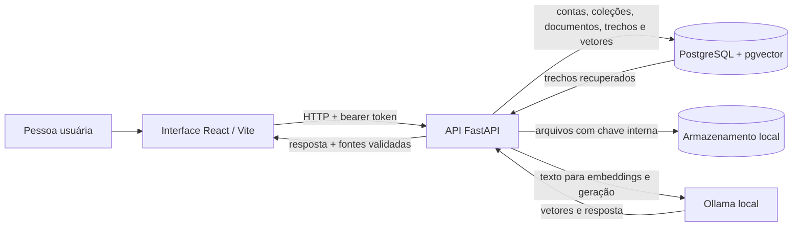

# AcervoIA

AcervoIA é uma aplicação local para organizar documentos técnicos e responder perguntas com evidências rastreáveis. O objetivo é reduzir o tempo gasto procurando instruções em manuais e evitar respostas que misturem equipamentos ou versões: a resposta deve se apoiar nos documentos da coleção e mostrar quais trechos foram usados; sem evidência suficiente, deve se abster.

O projeto está em desenvolvimento e foi validado localmente. Não há evidência de publicação, operação em produção ou avaliação representativa de uso real.

## Como funciona

1. A pessoa entra com uma conta criada localmente e organiza seu acervo em coleções privadas.
2. Envia um PDF, DOCX ou TXT (até 20 MiB) para uma coleção. Um hash SHA-256 permite reutilizar o mesmo documento dentro da mesma coleção sem duplicá-lo.
3. A API extrai o texto e o divide em trechos sobrepostos. Para PDFs, registra a página quando disponível.
4. A API envia os trechos ao Ollama local para gerar embeddings e os guarda no PostgreSQL com pgvector.
5. A pessoa escolhe o modo de busca e faz uma pergunta. A API recupera trechos, pede uma resposta fundamentada ao modelo local e retorna fontes construídas e validadas pelo backend. Respostas aceitas e abstenções ficam no histórico privado da coleção, com opção de consultar novamente.

Os dados de cada conta são isolados pelo usuário associado ao token; o cliente não escolhe o proprietário. O conteúdo dos documentos é tratado como dado não confiável, nunca como instrução para o modelo.

## Arquitetura



### Componentes e decisões

- **Frontend:** React, TypeScript e Vite em `web/`. O cliente centraliza chamadas HTTP e guarda o token em `sessionStorage`; a API é a autoridade final para autenticação e autorização.
- **API:** FastAPI, Pydantic e SQLAlchemy. Alembic controla a evolução do schema. Senhas são armazenadas como hashes Argon2; tokens JWT são assinados com uma chave configurada no ambiente.
- **Banco e arquivos:** PostgreSQL com a extensão pgvector armazena metadados, trechos e vetores de 768 dimensões. Os arquivos ficam no diretório local `data/uploads/`, com nomes internos aleatórios — não se usa o nome enviado como caminho.
- **Processamento:** PDF, DOCX e TXT são extraídos sem OCR e divididos em trechos de 1.000 caracteres, com sobreposição de 150. Reprocessar substitui os trechos anteriores; falhas de extração são registradas sem remover o arquivo.
- **Embeddings:** Ollama gera um vetor por trecho. O modelo registrado com o vetor permite identificar sua origem; a dimensão retornada é conferida contra a coluna pgvector.
- **Busca:** vetorial usa distância cosseno; textual combina full-text search do PostgreSQL com correspondência literal normalizada para códigos, siglas e modelos; híbrida combina rankings com Reciprocal Rank Fusion (RRF).
- **Resposta com fontes (RAG):** o serviço recupera trechos, instrui o modelo a escolher somente IDs de fonte permitidos e mantém o texto documental como entrada não confiável. O backend valida cada referência contra os resultados reais; permite uma única tentativa controlada de correção e, se não validar, retorna uma resposta segura sem exibir fontes inválidas.

## Rodar localmente

### Pré-requisitos

- Python dentro da faixa declarada em `pyproject.toml` (`>=3.12,<3.15`); Python 3.12 é usado pela CI.
- Node.js 22 para reproduzir a CI do frontend.
- Docker Compose para PostgreSQL com pgvector.
- Ollama local com os modelos de embeddings e chat descritos abaixo.

### Configuração

O Compose requer `POSTGRES_DB`, `POSTGRES_USER` e `POSTGRES_PASSWORD`. A aplicação e as migrações usam `DATABASE_URL`; autenticação usa `AUTH_SECRET_KEY`, com pelo menos 32 bytes. Configure esses nomes no ambiente local ou em um `.env` privado na raiz. Uvicorn pode carregá-lo com `--env-file`; o Alembic e o comando de criação de conta também carregam o `.env` local. Não adicione esse arquivo ao Git nem compartilhe seus valores.

| Variável | Uso |
|---|---|
| `POSTGRES_DB` | Nome inicial do banco no Compose. |
| `POSTGRES_USER` | Usuário inicial do banco no Compose. |
| `POSTGRES_PASSWORD` | Senha inicial do banco no Compose. |
| `DATABASE_URL` | Conexão PostgreSQL usada pela API e pelas migrações Alembic. |
| `AUTH_SECRET_KEY` | Assinatura e validação dos tokens JWT; requer pelo menos 32 bytes. |
| `OLLAMA_BASE_URL` | Endereço do serviço Ollama acessível pela API. |
| `OLLAMA_EMBEDDING_MODEL` | Tag do modelo de embeddings; os vetores precisam ter 768 dimensões. |
| `OLLAMA_CHAT_MODEL` | Tag do modelo de chat para geração de respostas. |
| `VITE_API_BASE_URL` | Base de URL da API usada pelo frontend. |
| `VITE_DEV_API_TARGET` | Destino do proxy `/api` do Vite durante desenvolvimento. |

O código usa `embeddinggemma` como modelo de embeddings padrão e `qwen2.5:3b` como modelo de chat padrão. Baixe no Ollama o modelo escolhido para cada função (por exemplo, com `ollama pull <tag-configurada>`). A dimensão de embeddings nesta versão é fixa em 768; trocar por um modelo com outra dimensão exige migração compatível do banco. O benchmark de respostas registrado em [`docs/avaliacao-inicial.md`](docs/avaliacao-inicial.md) usou uma configuração de chat diferente do padrão.

### Banco, API e primeira conta

Na raiz do repositório:

```bash
python3 -m venv .venv
source .venv/bin/activate
python -m pip install -e '.[dev]'
docker compose up -d db
alembic upgrade head
uvicorn acervo_ia.main:app --reload --app-dir src --env-file .env
```

O serviço PostgreSQL do Compose publica a porta local `5434` e usa um volume nomeado para os dados. Inicie o servidor Ollama instalado (por exemplo, `ollama serve` quando ele não for iniciado pelo aplicativo do sistema) e deixe acessíveis os modelos configurados. `/health` verifica a API; `/health/database` verifica o banco. A documentação interativa fica em `http://127.0.0.1:8000/docs`.

Em outro terminal, com o ambiente virtual ativo e o banco disponível, crie uma conta privada (não há cadastro público):

```bash
python -m acervo_ia.cli
```

O comando solicita o e-mail e lê a senha sem exibi-la. Faça login em `POST /auth/token` usando o e-mail no campo OAuth2 `username`; use o bearer token nas rotas protegidas. `GET /auth/me` confirma a identidade autenticada.

### Demonstração local com dados fictícios

Para preparar um fluxo demonstrável sem remover o login nem criar uma senha padrão, execute na raiz, com o banco migrado:

```bash
python -m acervo_ia.cli demo-seed
```

O comando cria uma conta com e-mail local aleatório e pede que você escolha a senha pelo prompt oculto. Ele adiciona uma coleção marcada **DEMO LOCAL** e os dois manuais TXT fictícios de `data/demo/`, com nomes também marcados como **DEMO FICTÍCIO**. Nenhum registro existente é atualizado. Entre pela tela normal de login usando o e-mail exibido no terminal e a senha que escolheu. Os documentos começam pendentes; para perguntar sobre eles, processe-os e gere embeddings pela interface com Ollama disponível.

Para remover apenas os itens que o seed criou:

```bash
python -m acervo_ia.cli demo-clean
```

Um manifesto local ignorado pelo Git guarda os IDs e as chaves internas desses itens, sem senha. A limpeza valida esse manifesto e remove somente os documentos, arquivos, coleção e conta correspondentes. Se você adicionar outros documentos ou coleções à conta de demonstração, os dados adicionais são preservados; a conta ou coleção também permanece quando ainda contém dados. Em caso de arquivo alterado ou manifesto inválido, a operação interrompe a limpeza em vez de ampliar o alvo. Execute `demo-clean` antes de preparar novamente a demonstração. A conta é apenas para desenvolvimento local, não tem credenciais padrão e não habilita bypass de autenticação.

### Interface web

Com API, PostgreSQL, conta e Ollama disponíveis:

```bash
cd web
npm ci
npm run dev
```

Abra `http://127.0.0.1:5173`. Em desenvolvimento, o Vite encaminha `/api` à API local. `VITE_DEV_API_TARGET` permite mudar o destino do proxy; `VITE_API_BASE_URL` muda a base usada pelo cliente HTTP. Entre, crie uma coleção, envie um documento, processe-o e gere seus embeddings. Na tela de consulta, escolha o modo, faça uma pergunta e confira as fontes exibidas.

## API principal

Exceto pelos endpoints de saúde e login, as rotas abaixo exigem bearer token. Recursos de outra conta não são revelados: quando aplicável, a API responde como se a coleção ou documento não existisse.

| Método e caminho | Função |
|---|---|
| `GET /health` | Verifica se a API responde. |
| `GET /health/database` | Verifica a conexão ao banco. |
| `POST /auth/token`, `GET /auth/me` | Login e identidade autenticada. |
| `GET/POST /collections` | Listar e criar coleções próprias. |
| `GET/PATCH/DELETE /collections/{collection_id}` | Consultar, editar e excluir coleção própria. |
| `POST /collections/{collection_id}/documents` | Enviar PDF, DOCX ou TXT (até 20 MiB). |
| `GET /collections/{collection_id}/documents` | Listar documentos da coleção. |
| `DELETE /collections/{collection_id}/documents/{document_id}` | Excluir documento e arquivo local. |
| `POST /collections/{collection_id}/documents/{document_id}/process` | Extrair texto e substituir os trechos do documento. |
| `POST /collections/{collection_id}/documents/{document_id}/embeddings` | Gerar ou atualizar vetores dos trechos. |
| `POST /collections/{collection_id}/search` | Recuperar trechos no modo `vector`, `text` ou `hybrid`. |
| `POST /collections/{collection_id}/ask` | Fazer uma pergunta e retornar resposta com fontes validadas. |
| `GET /collections/{collection_id}/history` | Listar perguntas e respostas próprias, com paginação por `limit` e `offset`. |

`/search` usa `hybrid` quando nenhum modo é informado; `/ask` e a interface começam em `vector`. Nos dois fluxos é possível selecionar `vector`, `text` ou `hybrid`.

O processamento de documentos retorna estado `pending`, `processing`, `completed` ou `failed`. Se um arquivo não tiver texto extraível, permanece armazenado e recebe uma falha segura; OCR não está implementado. Os documentos TXT e DOCX não têm número de página fornecido pelo extrator; a referência de página é incluída quando disponível, como em PDFs.

## Testes e CI

Backend:

```bash
python -m pytest
```

Frontend:

```bash
cd web
npm ci
npm test
npm run typecheck
npm run build
```

O build também roda o typecheck. O workflow [`.github/workflows/ci.yml`](.github/workflows/ci.yml) executa backend e frontend em jobs separados em pushes e pull requests: Python 3.12 com dependências de desenvolvimento; Node 22 com instalação por `npm ci`, testes, typecheck e build. A suíte automatizada usa SQLite onde precisa de banco e mocks para Ollama; não requer credenciais reais, `.env`, PostgreSQL ou Ollama.

## Benchmarks e interpretação

Os dois benchmarks usam os mesmos manuais fictícios e a amostra existente de 30 perguntas (25 respondíveis e cinco sem evidência):

```bash
alembic upgrade head
python scripts/evaluate_retrieval.py
python scripts/evaluate_answers.py
```

Ambos precisam do PostgreSQL/pgvector e do Ollama local; recuperação precisa do modelo de embeddings configurado e avaliação ponta a ponta também precisa do modelo de chat. Os registros de benchmark são temporários e revertidos ao final inclusive em falhas; indisponibilidade de serviço produz erro, não aprovação. Os testes comuns não chamam esses serviços.

O benchmark de recuperação compara `vector`, `text` e `hybrid` com Recall@5 e MRR, além de contar perguntas sem evidência que ainda receberam resultados. O benchmark de respostas agrega abstenções corretas, fontes válidas, alinhamento às seções anotadas, falhas após tentativa de correção e latência. Resultados e linha de base registrados estão em [`docs/avaliacao-inicial.md`](docs/avaliacao-inicial.md).

Interprete os números com cautela: a amostra tem só 25 exemplos respondíveis e cinco sem evidência, sobre dois manuais inventados. Métrica de recuperação de seção indica se um rótulo esperado apareceu no top 5, não se uma resposta é semanticamente correta, completa ou operacionalmente segura. Resultados também dependem de versões dos modelos, configurações, corpus, PostgreSQL e hardware; não provam que um modo é geralmente superior.

## Escopo e limitações conhecidas

Implementado: autenticação local sem cadastro público, coleções isoladas por conta, upload idempotente por conteúdo dentro da coleção, extração síncrona e chunking, embeddings via Ollama, busca vetorial/textual/híbrida e respostas fundamentadas com validação estrita das fontes.

Ainda não implementado: cadastro público, recuperação de senha, OCR, fila de processamento em segundo plano, continuidade de conversa com contexto entre perguntas, interface administrativa ou integração com outros serviços.

Limitações atuais: arquivos suportados apenas em PDF, DOCX e TXT até 20 MiB; armazenamento de arquivos é local ao host e não é uma solução compartilhada/replicada; os modelos de embedding precisam produzir vetores de 768 dimensões; os benchmarks são pequenos e sintéticos. Não há validação documentada de implantação, monitoramento, backup/recuperação, segurança operacional ou desempenho para produção. A aplicação não deve ser tratada como publicada ou pronta para produção com base neste repositório.

## Documentação do projeto

- [`docs/escopo-mvp.md`](docs/escopo-mvp.md): escopo histórico da primeira etapa planejada; não é inventário das funcionalidades atuais.
- [`docs/avaliacao-inicial.md`](docs/avaliacao-inicial.md): desenho, métricas e execuções observadas dos benchmarks.
- [`docs/superpowers/specs/2026-10-06-acervoia-web-design.md`](docs/superpowers/specs/2026-10-06-acervoia-web-design.md): contrato de design da interface web.
